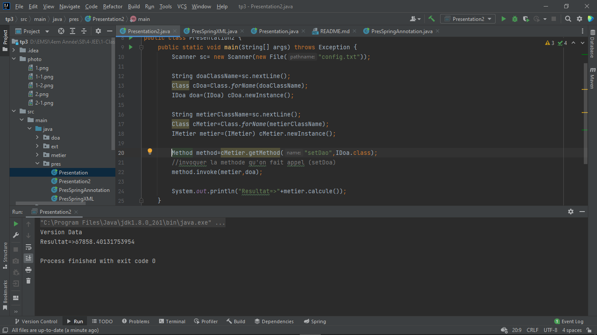

<h1>Introduction</h1>

    &nbsp;&nbsp;&nbsp;&nbsp;&nbsp;&nbsp;&nbsp;Tout d'abord quand on travaille sur un projet Informatique, il faut respecter certaine Exigence obligatoire. 
    Parmi eux :

    <ul>
        <li>Exigence fonctionnelles</li>
        <li>Exigence Techniques</li>
    </ul>

    &nbsp;&nbsp;&nbsp;&nbsp;&nbsp;&nbsp;&nbsp;Alors pour répondre à ces exigences on doit répondre aux Besoins fonctionnels (code métier) ; et en termes de performance et maintenance (Application doit évoluer dans le temps et doit être Fermée aux modifications et ouverte à l'extension. 
    &nbsp;&nbsp;&nbsp;&nbsp;&nbsp;&nbsp;&nbsp;pour respecter ces exigences il faut travailler avec le principe de l'inversion de control et l'injection des dépendances. 
    &nbsp;&nbsp;&nbsp;&nbsp;&nbsp;&nbsp;&nbsp;L'objectif de ce TP est de comprendre est de pratiquer ce principe avec différentes méthodes. 

<h1>Inversion de control</h1>

    &nbsp;&nbsp;&nbsp;&nbsp;&nbsp;&nbsp;&nbsp;Il Permet au développeur de s'occuper uniquement de code métier(Exigence Fonctionnelle).

    Pour Appliquer ce concept il y a 2 méthodes pour y faire

<ul>
    <li><strong>Couplage Fort :</strong> Quand une classe dépend d'une autre classe (lié à une classe)</li>
    <li><strong>Couplage Faible :</strong> Quand une classe dépend d'une Interface et non par une classe</li>
</ul>

<h6>N.B :</h6>

    Pour respecter le principe de l'inversion de control il faut utiliser le <strong>Couplage Faible</strong>

<h4>1-Exemple de Diagramme de class :</h4>

<h4>2-Code : </h4>

    
    

<h1>Injection des dépendances : </h1>

&nbsp;&nbsp;&nbsp;&nbsp;&nbsp;&nbsp;&nbsp;Il sert à Gérer l'inversion de controle.

<ul>
    
pour faire l'injection des dépendances il existe 3 méthodes : 

    <li>Instanciation Static.</li>
    <li>Instanciation Dynamic.</li>
    <li>Faire appel à <strong>Spring :</strong></li>
    <ul>
        <li>Par fichier XML</li>
        <li>Par Annotation</li>
    </ul>
</ul>
<h4>1-Instanciation static : </h4>

à l'aide de <strong>new</strong>

<h6>1-1-code et execution : </h6>

<h4>2-Instanciation Dynamic : </h4>

à l'aide de <strong>file : config.txt</strong>

<h6>2-1-code et execution : </h6>

<h6>2-3-file config.txt : </h6>

<h4>3-Spring : </h4>

pour travailler avec spring(faire injection des dépendances) nous pouvons utiliser 2 versions : 

<h6>N.B :</h6>

Pour utiliser spring il faut inclure le framework(la dépendance) dans le fichier "pom.xml"

Dépendance qu'il faut ajouter : <strong>spring-core</strong> && <strong>spring-Contexte</strong> && <strong>spring-beans</strong>

<h6>3-1-Version XML </h6>
<strong>File XML : </strong>

<strong>Code et exécution : </strong>

<h6>3-2-Version Annotation : </h6>

En travaillons avec spring il faut ajouter les annotations dans chaque classe : <strong>@Component</strong>

<Strong>Code et Execution : </Strong>

<h1>Conclusions : </h1>

L'objectif de ce TP et de pratiquer ce que spring fait comme role et aussi concevoir une application évolutive (pourrai évoluer avec le temps : besoins client)

